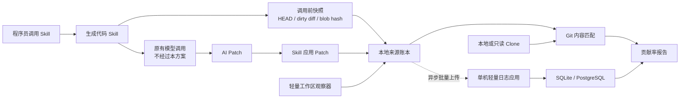

# AiGitDesign

> 面向主要由生成代码 skill 驱动、少量代码由程序员直接编写的项目，设计一套低成本、零额外操作、能够覆盖大多数常见作弊方式的 AI 代码贡献率统计方案。

## 1. 文档信息

| 项目 | 内容 |
|---|---|
| 文档名称 | AI 代码贡献率与程序员手工代码占比统计设计 |
| 版本 | v2.1 轻量版 |
| 状态 | 已批准，待试点验证 |
| 更新日期 | 2026-07-12 |
| 核心目标 | 用较小成本覆盖约 90% 已列举的常见作弊路径 |
| 第 1 档 | skill 本地来源账本 |
| 第 2 档 | 本地来源账本 + 单机轻量日志应用 |
| 明确不需要 | AI 大模型部门配合、模型网关、token 截取、Git 平台改造、CI/CD 改造 |

## 2. 核心结论

Git 日志只能说明某个提交包含什么代码，不能说明这些代码如何产生。Git author、邮箱、message 和时间也可以被提交者设置或重写，不能作为 AI 来源的可信证据。[Git commit 官方文档](https://git-scm.com/docs/git-commit)

本设计采用更轻的做法：

1. 生成代码 skill 在本地自动记录调用前状态、实际应用的 patch 和修改后状态。
2. Git 用来判断这些 patch 是否进入目标分支、是否仍然存在。
3. 第 2 档把事件摘要异步上传到一台服务器，防止程序员事后删除、改写或倒填本地日志。
4. 服务器不代理模型请求，不读取模型 token，不需要 AI 大模型部门参与。
5. 系统追求提高作弊成本和暴露异常，不追求司法取证或 100% 防作弊。

“约 90%”表示方案覆盖本文列举的大部分常见作弊路径，不表示已经达到 90% 检测准确率。实际效果必须通过试点和对抗测试验证。

## 3. 目标、非目标与零负担原则

### 3.1 目标

- 统计目标分支当前的 AI 代码占比和程序员手工代码候选占比。
- 统计一段周期内仍然存活的 AI/人工新增与改写代码。
- 正确处理 AI 修 Bug、补测试、重构、仿写、复制、移动、格式化和删除。
- 防止通过提交信息、Git 身份、提交时间、提交拆分和生成后删除来刷高 AI 贡献率。
- 防止程序员先手写代码，再让 AI 把整个 dirty diff 提交并计为 AI。
- 不要求 Git 托管平台或 CI/CD 平台增加插件、Webhook 或检查任务。
- 不打断开发流程；日志服务不可用时继续编码。

### 3.2 非目标

- 不证明法律意义上的原创性、著作权或许可证合规。
- 不保证识别个人网页 AI、其他设备或未接入工具产生后手工转录的代码。
- 不证明模型供应商实际使用了哪个底层模型。
- 不把 AI 行数直接等同于代码质量、开发效率或 skill 优秀程度。
- 不建设模型网关，不截取模型流式 token，不保存模型部门的调用日志。
- 不为最后少量高成本对抗建设 KMS/HSM、设备证明、受管远程开发环境或 CI 强制策略。

### 3.3 零额外工作量

程序员仍按原习惯调用 skill、查看结果、测试和提交代码，不需要：

- 添加 AI 注释、commit 前缀、trailer、PR 标签或日报；
- 切换 Git 用户或维护 AI 专用邮箱；
- 为每段代码选择“AI/人工”；
- 手工上传日志或补填来源；
- 在日志服务异常时暂停开发；
- 为抽样审计解释某段代码是谁写的。

## 4. 统计口径

### 4.1 两个维度

| 维度 | 含义 |
|---|---|
| `content_origin` | 当前代码内容通过哪条可观测路径产生 |
| `edit_actor` | 本次新增、修改、删除、复制、移动或格式化由谁执行 |

程序员发现 Bug，用自然语言 Prompt 让 AI 修改代码：

```text
content_origin = AI_SKILL
edit_actor = AI
human_directed = true
```

任务由人发起不影响代码归因。只要具体 patch 由模型产生并由 skill 应用，就计为 AI。

### 4.2 来源分类

| 分类 | 定义 | 主统计处理 |
|---|---|---|
| `AI_SKILL` | 生成代码 skill 记录并实际应用的 AI patch | 计入 AI |
| `AI_REUSED` | AI 在新位置仿写或复制仓库已有代码 | 计入 AI，并统计复用率 |
| `AI_DERIVED` | AI 代码后来被局部修改的复合区域 | 按仍保留的 AI 内容计 |
| `MANUAL_CANDIDATE` | 观察器健康期间、发生在 AI apply 事务之外的代码编辑 | 计入手工候选，不宣称绝对人工原创 |
| `USER_SUPPLIED` | Prompt 直接提供完整代码或 patch，模型主要照抄 | 不计本次 AI 新生成，单独展示 |
| `UNKNOWN` | 观察器空窗、外部工具、无法匹配或来源不明 | 不归给 AI 或人工 |
| `LEGACY_UNKNOWN` | 采集上线前已存在的代码 | 单独展示 |

`MANUAL_CANDIDATE` 是实用统计口径，不是强来源证明。它可能包含格式器、外部脚本或未接入 AI 的输出；因此报告必须同时显示未知和覆盖率。

### 4.3 已确认的边界规则

- 程序员 Prompt 让 AI 修 Bug、补测试或重构：AI 新增和替换的代码计 AI。
- AI 参考已有人工模块生成新模块：新模块计 `AI_REUSED`，即使代码高度相似或完全相同。
- AI 把既有函数复制到新文件：新实例计 `AI_REUSED`。
- AI 只移动代码：计 AI 动作，存量内容来源不变。
- AI 只格式化代码：计 AI 动作，非空白内容来源不变。
- 程序员在调用前已写好 dirty diff，AI 只 add/commit：dirty diff 不计 AI。
- Prompt 直接提供大段完整代码，AI 原样插入：重合部分计 `USER_SUPPLIED`。
- 程序员只审查、接受、拒绝或运行测试：不产生程序员手工代码。

## 5. 轻量威胁模型

### 5.1 假设

- 程序员可以控制本机 Git 配置、提交信息、系统时间和工作区。
- skill 可以修改，能够在模型调用和文件修改前后自动记录事件。
- 日志服务器由项目或平台团队管理，普通程序员没有数据库修改权限。
- 统计任务可以使用现有只读权限拉取 Git 日志和文件内容。
- AI 大模型部门不参与本方案。

### 5.2 信任边界

- 本地事件证明“安装的 skill 声称发生了什么”，不能抵抗被彻底篡改的 skill。
- 服务端接收时间证明“某事件最晚在何时上传”，不能证明事件内容一定真实。
- Git 内容匹配证明“记录的 patch 与目标分支内容一致”，不能证明模型一定产生了该 patch。
- 三类证据组合后足以提高常见作弊成本，但不构成强取证。

### 5.3 不处理的高成本对抗

- 程序员修改 skill 后伪造一整套自洽事件。
- 使用外部 AI 后逐字人工转录。
- 将人工代码拆散、编码或语义改写后让模型重建。
- 程序员与日志服务器管理员合谋。
- 同时攻破开发机、日志服务器和统计任务。

这些场景属于剩余风险，不为其建设重型平台。

## 6. 总体架构



日志应用不位于模型调用链上。模型响应速度、鉴权方式和 token 流均不受影响。

### 6.1 组件

| 组件 | 职责 |
|---|---|
| Skill 采集适配器 | 捕获调用前状态、AI patch、应用结果和 skill 版本 |
| 工作区观察器 | 标记 AI apply 事务，记录事务外编辑和心跳 |
| 本地来源账本 | 保存事件、顺序、哈希链和待上传状态 |
| 异步上传器 | 后台批量上传；失败时排队，不阻塞开发 |
| 轻量日志应用 | 只接收事件摘要、生成服务器接收时间、拒绝重复事件 |
| Git 匹配器 | 将事件映射到 commit 和目标分支快照 |
| 报告器 | 计算 AI、手工候选、用户提供、未知和辅助指标 |

## 7. 端到端流程

### 7.1 会话开始

skill 自动记录：

- `repo_id`、`session_id` 和连续序号；
- 当前 HEAD 和 tree；
- index 与 dirty diff 摘要；
- 涉及文件的 before blob hash；
- skill 名称、版本和构建摘要；
- 观察器心跳状态。

调用前已有 dirty diff 被单独冻结，后续不能因为 AI 帮忙提交而变成 AI 代码。

### 7.2 AI 生成和应用

1. skill 按现有方式直接调用模型。
2. 本地检查 Prompt 是否直接包含大段完整代码。
3. skill 得到模型输出或结构化 patch。
4. 打开 AI apply transaction。
5. 记录实际成功应用的文件、patch hash、before/after blob 和增删行。
6. 关闭 transaction。
7. 失败、部分应用、Undo 或回滚按实际结果记录。

本方案不截取模型 token，也不要求改变现有模型 API。

### 7.3 事务外编辑

- 观察器健康时，AI transaction 外发生的编辑记为 `MANUAL_CANDIDATE`。
- 已知 formatter、文件移动和生成文件按专门规则处理。
- 观察器未运行、文件被外部进程覆盖或无法确定上下文时记为 `UNKNOWN`。
- 心跳中断期间不得用“总量减 AI”直接补成人工代码。

### 7.4 Git 关联

1. 发现新 commit 时记录 commit、parent 和 tree hash。
2. 从目标分支按 DAG 遍历，不简单累加所有 commit 行数。
3. 用 blob、patch hash 和上下文匹配事件。
4. rebase、squash、cherry-pick 使用 `git patch-id --stable` 辅助匹配。[git patch-id](https://git-scm.com/docs/git-patch-id)
5. merge 只统计最终 tree 中实际存在的代码，避免重复计算。
6. revert、删除或完整重写会自动移除相应存量贡献。

## 8. 事件设计

### 8.1 事件示例

```json
{
  "schema_version": "1.0",
  "event_id": "01K0V6QZB5AF3R8N2M7J9C4DTE",
  "event_type": "patch_applied",
  "repo_id": "repo-a17c3e91",
  "session_id": "01K0V6QW7D8J4P2HY6N5C3M9RA",
  "sequence": 12,
  "previous_event_hash": "f0ab34c29c50c17d",
  "client_observed_at": "2026-07-12T10:15:30.123Z",
  "skill_name": "phaseA-codegen",
  "skill_version": "3.4.1",
  "skill_build_hash": "29b3dc391f04c89d",
  "head_before": "7ab84d1",
  "dirty_diff_hash_before": "e3b0c44298fc1c14",
  "path": "src/order/OrderService.java",
  "patch_hash": "927af1d42963aee1",
  "before_blob": "19f94c1",
  "after_blob": "a28b0d9",
  "lines_added": 37,
  "lines_deleted": 8,
  "prompt_code_overlap_lines": 0,
  "event_hash": "98b367c1d5d818bb"
}
```

示例为便于阅读截短了 hash；实际事件使用完整 SHA-256。默认不上传完整 Prompt、模型 token 或源代码，只上传摘要、哈希、路径和计数。需要支持部分改写时，可上传规范化 token 指纹，但仍不上传原始代码。

### 8.2 事件类型

| 事件 | 用途 |
|---|---|
| `session_started` | 建立仓库和会话基线 |
| `generation_finished` | 记录 skill 完成一次生成 |
| `patch_applied` | 记录实际应用范围 |
| `workspace_edit` | 记录事务外编辑 |
| `validation_finished` | 记录测试、编译、打包结果 |
| `commit_linked` | 关联 Git commit |
| `undo_or_delete` | 更新存量和存活率 |
| `heartbeat` | 暴露观察器空窗 |
| `ref_snapshot` | 定义统计窗口的目标分支快照 |

### 8.3 本地哈希链

```text
event_hash = SHA-256(previous_event_hash + stable_json(event_without_event_hash))
```

- stable JSON 由同一份 skill 公共库生成，固定字段顺序和 UTF-8 编码。
- 每个事件引用前一事件 hash。
- 哈希链可以发现单条删除、插入和乱序，但本机管理员仍可整体替换账本。
- 第 2 档通过及时上传服务器降低整体替换的可行性。

## 9. 单机轻量日志应用

### 9.1 部署形态

推荐部署一个普通 Docker 容器：

```text
HTTP API + 定时报表任务 + SQLite
```

团队或仓库数量增加后，可把 SQLite 换成现有 PostgreSQL。初期不需要消息队列、对象存储、KMS/HSM 或复杂微服务。

### 9.2 API

| 接口 | 用途 |
|---|---|
| `POST /api/v1/events/batch` | 批量追加事件，按 event ID 幂等 |
| `POST /api/v1/heartbeats` | 上传观察器健康状态 |
| `POST /api/v1/ref-snapshots` | 记录目标分支观察快照 |
| `GET /api/v1/reports/{repoId}` | 获取聚合报告 |
| `GET /health` | 服务健康检查 |

服务器为每个事件增加：

- `server_received_at`；
- 单调递增的 `server_sequence`；
- `upload_delay_seconds`；
- `duplicate`、`out_of_order`、`sequence_gap` 等异常标记。

### 9.3 最小数据表

| 表 | 内容 |
|---|---|
| `event_log` | 只追加的事件摘要和服务器接收时间 |
| `ref_snapshot` | 仓库、目标 ref、观察到的 commit |
| `report_summary` | 周期性聚合结果 |

普通程序员使用的 API key 只有插入权限。应用不提供更新和删除事件的接口；管理员操作另记审计日志。

### 9.4 轻量安全措施

- 使用现有 HTTPS 反向代理。
- 每个团队或设备使用独立 API key。
- `event_id` 设置唯一约束，防止重放。
- 检查 repo、session 和 sequence 连续性。
- 使用服务器时间，不信任客户端时间做唯一判断。
- 每日备份数据库，并保存每日事件数量和链尾 hash。
- API key 泄露、服务器管理员修改数据库属于剩余风险。

这些措施的目的只是防止普通开发者事后改日志，不是建设密码学证明系统。

## 10. 两档方案对比

| 能力 | 第 1 档：仅本地 | 第 2 档：本地 + 日志应用 |
|---|---|---|
| 程序员额外操作 | 无 | 无 |
| AI 部门配合 | 不需要 | 不需要 |
| Git/CI 平台改造 | 不需要 | 不需要 |
| 服务器 | 不需要 | 一台普通服务器 |
| 离线开发 | 支持 | 支持，恢复后补传 |
| 事后删除本地日志 | 难以防止 | 服务端副本可暴露 |
| 倒填时间 | 本机时间可改 | 服务器接收时间可揭示 |
| 中央统计 | 较难 | 原生支持 |
| 对篡改 skill 的抵抗力 | 低 | 低；服务端主要防事后改日志 |
| 推荐用途 | 试点和降级 | 正式统计 |

第 2 档并不证明模型真实输出，只比第 1 档更难事后修改历史。

## 11. 归因算法

### 11.1 轻量计算单位

- 主单位采用规范化非空代码行。
- 忽略缩进、行尾空格和纯空白变化。
- 混合修改行在支持时使用简单 token diff；无法可靠拆分时标为 `MIXED` 或 `UNKNOWN`。
- 产品代码、测试、配置、注释/文档分别分桶。
- vendor、第三方依赖、生成产物、lockfile、minified 文件和二进制排除或单列。

不在第一版建设多语言 AST、语义相似检测或复杂代码水印。

### 11.2 匹配顺序

1. Prompt 直接代码重合优先标为 `USER_SUPPLIED`。
2. before/after blob 和 patch 完全一致时精确匹配。
3. 稳定 patch ID 与唯一上下文一致时高置信匹配。
4. 纯移动保持原来源。
5. AI 在新位置复制或仿写时标为 `AI_REUSED`。
6. 已知格式化事务不转移非空白内容来源。
7. 模糊语义相似不自动认定 AI，直接进入未知或抽样审计。

`git blame` 只能显示某行最后由哪个提交修改，不能反映已删除代码或可靠处理混合行，因此只作辅助，不作为主算法。[git blame](https://git-scm.com/docs/git-blame)

## 12. 统计指标

设：

- `A`：`AI_SKILL`、`AI_REUSED` 和仍保留的 AI 派生代码；
- `M`：`MANUAL_CANDIDATE`；
- `S`：`USER_SUPPLIED`；
- `U`：`UNKNOWN` 与 `LEGACY_UNKNOWN`；
- `N = A + M + S + U`。

### 12.1 当前存量

```text
已记录 AI 存量占比 = A / N
手工候选存量占比 = M / N
来源未决占比 = (S + U) / N
采集覆盖率 = (A + M + S) / N
```

报告必须明确写“手工候选”，不能把它宣传为绝对人工原创。

### 12.2 窗口内存活贡献

统计任务在周期开始和结束记录目标 ref：

```text
AI 窗口存活贡献率 =
周期内首次进入目标分支且期末仍存在的 AI 代码
/ 周期内首次进入且期末仍存在的全部代码
```

没有周期开始快照时不发布该指标，不使用可伪造的 Git author date 补造时间。

### 12.3 AI 动作和有效删除

分别报告 AI 新增、替换、复制、移动、格式化和删除。AI 删除人工旧代码计 AI 动作，但不增加 AI 存量。

```text
D_AI = AI 删除且期末仍未恢复的代码
D_MANUAL = 手工候选删除且期末仍未恢复的代码
D_UNKNOWN = 执行方未知且期末仍未恢复的代码

AI 有效删除份额下限 =
D_AI / (D_AI + D_MANUAL + D_UNKNOWN)
```

未知删除必须进入分母，并同步展示删除归因覆盖率，不能只在已归因删除中计算漂亮比例。

### 12.4 复用、去重和存活

- `AI_REUSED` 仍进入物理实例 AI 占比。
- 同时强制展示 clone-family 去重后的 AI 独特代码占比。
- 展示 AI 代码 14/30/90 天保留率。
- 展示生成后删除、revert 和人工重写比例。

物理实例占比不得脱离复用率和去重指标单独用于评价 skill。

## 13. 边界案例

| 场景 | 处理 |
|---|---|
| 人发现 Bug，Prompt 让 AI 修复 | AI 新 patch 计 AI |
| AI 反复调试并修改 | 最终保留的 AI patch 计 AI |
| AI 修改人工函数一部分 | 新增/替换部分计 AI，未改部分保持原来源 |
| 人工局部修改 AI 代码 | 保留 AI 部分仍计 AI，新编辑计手工候选 |
| AI 仿写已有模块 | 新模块计 `AI_REUSED` |
| AI 复制已有函数到新文件 | 新实例计 `AI_REUSED` |
| AI 移动代码 | 计 AI 动作，内容来源不变 |
| AI 格式化代码 | 计 AI 动作，非空白内容来源不变 |
| 人工 dirty diff 交给 AI 提交 | 不计 AI |
| Prompt 给完整代码让 AI 插入 | 重合部分计 `USER_SUPPLIED` |
| AI 生成后删除 | 不进入当前存量，保留动作记录 |
| AI 删除人工代码 | 计 AI 删除动作，不产生 AI 存量 |
| rebase/squash/cherry-pick | 内容匹配，只计一次 |
| revert | 被撤销代码退出当前存量 |
| merge conflict 无法匹配 | 记未知 |
| 网页 AI 代码粘贴 | 记手工候选或未知，不伪装为已记录 AI |
| 采集上线前代码 | 记 `LEGACY_UNKNOWN` |

## 14. 常见作弊与处理

| 作弊方式 | 轻量控制 | 效果 |
|---|---|---|
| 模仿 AI commit message | 提交信息不参与公式 | 高 |
| 伪造 AI 用户名、邮箱和时间 | Git 自述不参与正式归因 | 高 |
| 先手写，再让 AI 提交 dirty diff | 调用前冻结 dirty diff | 高 |
| Prompt 填完整人工代码让 AI 照抄 | 本地 Prompt-code overlap | 中高 |
| 让 AI 提交整个工作区 | 只认本次 apply transaction | 高 |
| 生成大量代码后删除 | 存量和保留率抵消刷量 | 高 |
| 大量复制已有代码 | 物理占比与 clone 去重并列 | 中高 |
| 拆分、squash 或 rebase | 按内容而非提交粒度匹配 | 高 |
| 删除或改写本地日志 | 服务端已上传副本、序号和接收时间 | 中高 |
| 修改本机时间倒填事件 | 显示服务器接收时间和上传延迟 | 高 |
| 停止观察器后修改 | 心跳空窗和 sequence gap | 中 |
| 重放旧事件 | event ID 唯一约束和 repo/session 绑定 | 高 |
| 修改 skill 伪造完整事件链 | 版本/build hash 只能提示异常 | 低 |
| 外部 AI 后逐字转录 | 无可靠自动识别 | 低 |

前三列的“高/中/低”是设计预期，不是未经验证的准确率。

## 15. 异常与降级

| 异常 | 处理 |
|---|---|
| 日志服务器不可用 | 本地排队，不阻塞生成、测试或提交 |
| 恢复后补传 | 保留原客户端时间，同时记录服务器接收时间和延迟 |
| 补传延迟过长 | 标 `LATE_UPLOAD`，降低报告可信度 |
| 重复上传 | 按 event ID 幂等忽略 |
| sequence 缺口 | 标记缺失区间，相关代码进入未知 |
| 观察器崩溃 | 心跳空窗内新增进入未知 |
| Patch 部分应用 | 只统计实际成功部分 |
| Undo、delete、revert | 更新存量和保留率 |
| Merge conflict | 无法唯一匹配部分进入未知 |
| 不支持的文件类型 | 排除或单独分桶 |
| Git 历史重写 | 重新遍历当前可达 DAG |

## 16. 报告设计

每份报告至少包含：

- 仓库、目标 ref、快照 commit 和统计周期；
- 证据状态：`LOCAL_ONLY`、`SERVER_RECEIVED` 或 `GIT_MATCHED`；
- AI、AI 复用、手工候选、用户提供、未知和遗留未知；
- 当前存量、窗口存活贡献、AI 动作和有效删除；
- 物理实例 AI 占比与 clone-family 去重 AI 占比；
- 14/30/90 天保留率和生成后删除率；
- 观察器在线率、sequence gap、迟到上传比例；
- skill 名称、版本和构建摘要；
- 产品代码、测试、配置、注释/文档分桶。

证据状态只描述事件保存和 Git 匹配程度，不表示服务器证明了模型真实输出。

## 17. 如何评价生成代码 skill

AI 占比高不等于 skill 优秀。建议同时比较：

- AI patch 进入目标分支的转化率；
- 首次测试、编译、打包通过率；
- 达到通过所需的 AI 迭代次数；
- 14/30/90 天保留率；
- 人工后续重写和 revert 比例；
- 复用率及 clone-family 去重代码量；
- 单位有效存活代码的模型成本和耗时。

测试、编译和打包 skill 可自动生成 `validation_finished`，程序员无需填报。

## 18. 原 README 措施的定位

| 原措施 | 处理 |
|---|---|
| AI 在代码里加时间和用途注释 | 不建议；可编辑、会过期、污染源码 |
| 记录文件路径和 Git hash | 保留，并增加 patch 与 before/after blob |
| `feat(AI):` / `fix(AI):` | 可作展示，不进入正式统计 |
| AI 独立 Git 用户和邮箱 | 只能展示提交身份，不能证明代码来源 |
| 生成后立即测试并提交 | 保留；只提交本次 AI patch，不能吞并 dirty diff |
| 本地 Git hook | 可用于唤醒采集器，但不能作为防作弊依据 |

Git hook 可以被 `--no-verify` 跳过，因此只能改善自动化体验。[Git hooks](https://git-scm.com/docs/githooks)

## 19. 业界方案与可借鉴措施

没有找到与本设计完全同构、并公开给出对抗测试准确率的案例。以下产品证明“客户端自动遥测 + Git 内容关联”是切实可行的方向，但不代表它们能绝对识别 AI/人工。

| 方案 | 已有能力 | 可借鉴点 |
|---|---|---|
| GitHub Copilot Usage Metrics | 自动统计建议、接受和 AI 增删行 | 使用量遥测和工具版本覆盖。[官方文档](https://docs.github.com/en/copilot/reference/copilot-usage-metrics/lines-of-code-metrics) |
| Cursor AI Code Tracking API | 按 commit SHA 统计 Tab、Composer 和 non-AI 行 | 客户端事件关联 commit，最接近本设计。[官方文档](https://docs.cursor.com/en/account/teams/ai-code-tracking-api) |
| JetBrains AI Activity and Impact | 自动统计生成、接受、修改和删除行 | IDE 内自动采集、无需开发者标记。[官方文档](https://www.jetbrains.com/help/ide-services/ai-activity-and-impact.html) |
| Claude Code Analytics / OpenTelemetry | session、工具调用、LoC、commit 和 PR 指标 | 后台事件和受管配置。[官方文档](https://code.claude.com/docs/en/monitoring-usage) |
| DX AI Code Insights | 端侧 daemon/hooks 记录 AI 原始、修改、保留、删除代码和 commit SHA | 本地 SQLite、后台 daemon 和代码保留追踪。[数据模型](https://docs.getdx.com/schema/ai_code_commits/)、[限制说明](https://docs.getdx.com/ai-code-insights/troubleshooting/) |
| LinearB AI Analytics | 结合厂商 API、Bot author、co-author 和时间相关性 | 零人工标记，但部分归因是启发式。[官方说明](https://linearb.helpdocs.io/article/7y766re1v8-how-linear-b-calculates-ai-attribution) |
| Swarmia AI impact | 用 Agent author、co-author 和 24 小时窗口标记 AI-assisted PR | 自动标记和异常解释；官方承认可能假阳性。[官方说明](https://help.swarmia.com/use-cases/measure-the-productivity-impact-of-ai-tools/ai-impact-on-pr-metrics) |

DX 官方公开了 Booking.com 使用 DX 衡量生成式 AI 采用和交付影响的案例；这是供应商案例，不是独立准确性审计。[Booking.com 案例](https://getdx.com/customers/booking-uses-dx-to-measure-impact-of-genai/)

### 19.1 可以直接采用的轻量措施

- 在自研 skill 中内置 before/after、patch 和 dirty diff 采集。
- skill 自动启动本地观察器和异步上传器。
- 使用一台服务器接收摘要并记录服务器时间。
- 统计任务按只读方式拉取 Git，不改仓库配置。
- 用 commit 内容匹配代替提交者自我声明。
- 用 sequence、heartbeat、上传延迟和唯一 event ID 暴露异常。
- 由统计人员做抽样审计，不找程序员补标。

### 19.2 只能作为弱信号

- Commit message、AI 邮箱、co-author 和分支前缀；
- 代码注释和本机时间戳；
- Prompt、session、token 数和接受行数；
- 代码风格、命名、困惑度和被动 AI 检测器；
- 代码水印和“让另一个模型判断”。

跨语言研究显示，现有事后 AI 代码检测器缺乏承担生产来源判定所需的泛化能力，应只用于抽样，不写回正式归因。[ICSE 2025 研究](https://arxiv.org/abs/2411.04299)

## 20. 隐私与数据安全

- 默认不上传完整 Prompt、模型 token 或源代码。
- 上传文件路径、哈希、行数、版本和事件关联信息。
- 如需部分改写匹配，只上传不可逆 token 指纹。
- API key 按团队或设备隔离并可撤销。
- 普通程序员没有事件更新和删除权限。
- 报告按项目、团队和 skill 版本聚合，不把 AI 行数作为个人绩效唯一依据。
- 配置事件和报告保留期，过期后由管理员统一清理。

## 21. 验证与验收

### 21.1 黄金测试场景

- AI 新增、人工编辑和 AI 修 Bug；
- 仿写、复制、移动、格式化和局部重写；
- Prompt 直接粘贴完整代码；
- dirty diff 交给 AI 提交；
- 生成后删除、Undo、revert；
- rebase、squash、cherry-pick 和 merge；
- 离线补传、重复事件、sequence gap 和心跳中断；
- 修改本机时间和删除本地日志；
- 多语言、不同换行符和生成文件排除。

### 21.2 验收要求

- 不得把调用前 dirty diff 计为 AI。
- 自然语言 Prompt 让 AI 修改产生的新代码必须计 AI。
- AI 仿写或复制到新位置必须计 `AI_REUSED`。
- 纯移动和格式化不得转移存量来源。
- 服务器不可用不得阻塞开发。
- 上传后删除本地事件必须能够从服务器副本发现。
- 重复、乱序、迟到和缺口必须在报告中展示。
- 全流程不得要求程序员补标签或补说明。

### 21.3 “90% 效果”的验证方式

建立作弊场景清单，对每个场景执行自动回放：

```text
常见作弊路径覆盖率 =
能够被阻止或在报告中形成明显异常的场景数
/ 纳入测试的常见作弊场景总数
```

目标覆盖率为 90%。该指标是场景覆盖率，不是逐行识别准确率。未覆盖场景和误判必须单独公布。

## 22. 部署与推行

### 阶段 0：规则冻结

- 确定目标分支、文件排除和统计周期。
- 将采集上线前代码标为 `LEGACY_UNKNOWN`。
- 建立黄金测试仓库。

### 阶段 1：第 1 档试点

- 只启用本地账本、观察器和 Git 匹配。
- 验证性能、未知比例和误匹配。
- 不用于个人考核。

### 阶段 2：部署单机日志应用

- 使用一个 Docker 容器和 SQLite。
- 配置 HTTPS、API key、每日备份和只读 Git 凭据。
- 启用批量上传、服务器时间、sequence gap 和迟到事件报告。

### 阶段 3：稳定运行

- 数据量增大时把 SQLite 换成 PostgreSQL。
- 按月复盘作弊场景覆盖率、未知率和 skill 质量指标。
- 只有收益明确时才增加新措施，避免为少量极端对抗持续堆叠复杂度。

## 23. 最终结论

在当前约束下，推荐方案是：

```text
生成代码 Skill 自动采集
    + 本地哈希链
    + 单机轻量日志应用
    + Git 内容匹配
    + 覆盖率、复用率和存活率报告
```

服务器应用只负责接收摘要、记录服务器时间和保存不可由普通程序员修改的副本，不参与模型调用。该方案不能提供强来源证明，但实施成本低，不依赖 AI、Git 或 CI/CD 平台配合，也不给程序员增加操作。

它的目标是覆盖大多数常见作弊方式、让异常可见并提高作弊成本。对于修改 skill 伪造完整事件链、外部 AI 后人工转录和管理员合谋等少量高成本场景，明确接受为剩余风险，不为最后少量效果建设重型系统。
